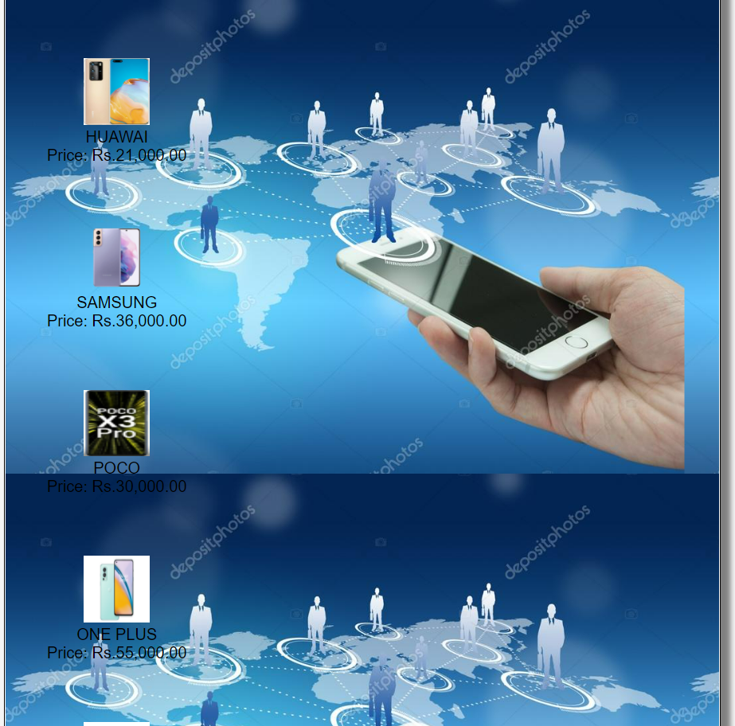
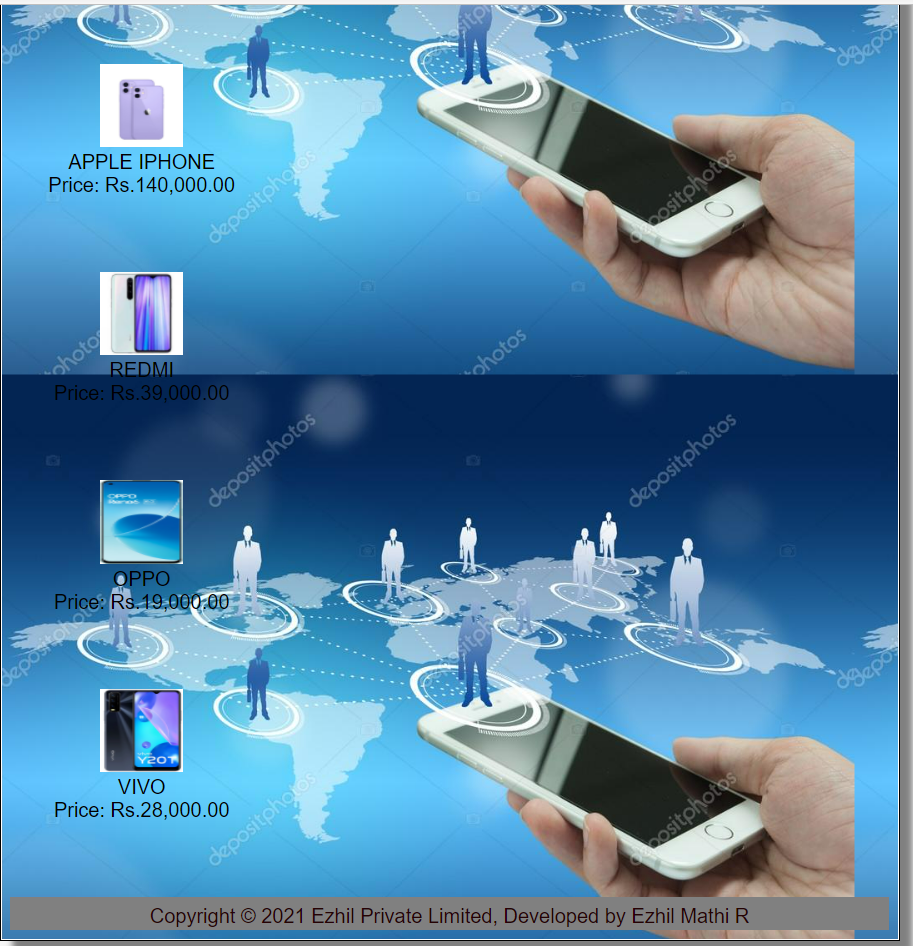

# Web Design for a Software Product Company

## AIM:

To design a static website for a software product company company.

## DESIGN STEPS:

### Step 1:

Requirement collection.

### Step 2:

Creating the layout using HTML and CSS.

### Step 3:

Updating the sample content.

### Step 4:

Choose the appropriate style and color scheme.

### Step 5:

Validate the layout in various browsers.

### Step 6:

Validate the HTML code.

### Step 6:

Publish the website in the given URL.

## PROGRAM :
Layout.css:
```
* {
  box-sizing: border-box;
  font-family: Arial, Helvetica, sans-serif;
}
body {
  background-color: whitesmoke;
  color: black;
  font-size: x-large
}
.container {
  width: 1080px;
  margin-left: auto;
  margin-right: auto;
  border-width: 1px 1px 1px 1px;
  border-style: solid;
  box-shadow: 15px 15px 8px gray;
}

.banner {
  display: block;
  width: 100%;
  height: 250px;
  text-align: center;
  font-size: 60px;
  background-image: url("/static/img/logoo.png");
  background-size: 100% 100%;
  margin: 0px 0px 0px 0px;
  padding-top: 150px;
  color: white;
}

.menu {
  display: block;
  width: 100%;
  height: 50px;
  font-size: larger;
  background-color: grey;
  text-align: center;
  padding-top: 15px;
  margin: 0px 0px 0px 0px;
  border-width: 1px;
}

.menuitem {
  display: inline-block;
  margin-left: 10px;
  margin-right: 10px;
}
.menuitemselected {
  display: inline-block;
  margin-left: 10px;
  margin-right: 10px;
  color: #16d1ae;
}

.menuitem a {
  text-decoration: none;
  color: #250204;
}

.content {
  display: block;
  width: 100%;
  background-image: url("/static/img/bg2.jpg");
  min-height: 500px;
  margin: 0px 0px 0px 0px;
  border-width: 1px;
  border-color: white;
  border-style: solid;
}
.homecontent {
  min-height: 500px;
  margin: 10px 10px 10px 10px;
}
.homecontent h1 {
  text-align: left;
}
.homecontent img {
  float: right;
  width: 400px;
  height: 300px;
  margin-left: 10px;
}

.contenttext {
  text-align: justify;
}

.productcontent {
  min-height: 500px;
  margin: 10px 10px 10px 10px;
}

.productcontent h1 {
  text-align: left;
}

.productitems {
  display: block;
}

.productitem {
  display: inline-block;
  width: 30%;
  height: 250px;
  text-align: center;
}

.productitem img {
  width: 100px;
  height: 100px;
  display: block;
}
.productitem .itemimage {
  display: block;
  margin-left: auto;
  margin-right: auto;
  width: 100px;
  margin-bottom: 5px;
}

.productitem .itemname {
  display: block;
}
.productitem .itemprice {
  display: block;
}

.footer {
  display: block;
  width: 100%;
  height: 40px;
  background-color:grey;
  text-align: center;
  padding-top: 10px;
  margin: 0px 0px 0px 0px;
  color: #250204;
}

```
Home Page:
```
<html lang="en">
  <head>
    <title>EZHIL Private Limited</title>
    <link rel="stylesheet" href="./css/layout.css" />
    <link rel="icon" href="./img/icon.png" type="image/x-icon" />
  </head>

  <body>
    <div class="container">
      <div class="banner">Ezhil Private Limited</div>
      <div class="menu">
        <div class="menuitemselected"><a href="/static/home.html">Home</a></div>
        <div class="menuitem"><a href="/static/products.html">Products</a></div>
        <div class="menuitem"><a>People</a></div>
        <div class="menuitem"><a>Contact Us</a></div>
      </div>
      <div class="content">
        <div class="homecontent">
          <h1>About Us</h1>>
          <div class="contenttext">
            A mobile phone, cellular phone, cell phone, cellphone, handphone, or hand phone, 
            sometimes shortened to simply mobile, cell or just phone, is a portable telephone 
            that can make and receive calls over a radio frequency link while the user is moving
            within a telephone service area. The radio frequency link establishes a connection 
            to the switching systems of a mobile phone operator, which provides access to the 
            public switched telephone network (PSTN). Modern mobile telephone 
            services use a cellular network architecture and, therefore, mobile telephones are
            called cellular telephones or cell phones in North America.
            <br />
            In addition to telephony, 
            digital mobile phones (2G) support a variety of other services, such as text messaging, 
            MMS, email, Internet access, short-range wireless communications (infrared, Bluetooth), 
            business applications, video games and digital photography. Mobile phones offering only
             those capabilities are known as feature phones; mobile phones which offer greatly advanced
             computing capabilities are referred to as smartphones.
            <ul>
              <li>Simple to learn, easier to use</li>
              <li>maintaining privacy</li>
              <li>Anywhere, anytime and secure access</li>
            </ul>
          </div>
        </div>
      </div>
      <div class="footer">
        Copyright &#169; 2021 EZHIL Private Limited, Developed by Ezhil Mathi R
      </div>
    </div>
  </body>
</html>

```
Product Page:
```
<!DOCTYPE html>
<html lang="en">
  <head>
    <title>Ezhil Private Limited</title>
    <link rel="stylesheet" href="./css/layout.css" />
    <link rel="icon" href="./img/icon.png" type="image/x-icon" />
  </head>

  <body>
    <div class="container">
      <div class="banner">Ezhil Private Limited.</div>
      <div class="menu">
        <div class="menuitem"><a href="/static/home.html">Home</a></div>
        <div class="menuitemselected">
          <a href="/static/products.html">Products</a>
        </div>
        <div class="menuitem"><a>People</a></div>
        <div class="menuitem"><a>Contact Us</a></div>
      </div>
      <div class="content">
        <div class="productcontent">    
          <h1>Our Premium Products</h1>
          <div class="productitems">
              <div class="productitem"> 
                  <div class="itemimage">
                  
                  </div>
                  <div class="itemname">MI</div>
                  <div class="itemprice">Price: Rs.49999.00 </div>
              </div>
              <div class="productitem"> 
                  <div class="itemimage">
                  
                  </div>
                  <div class="itemname">MOTO</div>
                  <div class="itemprice">Price: Rs.29,000.00 </div>
              </div>
              <div class="productitems">
                <div class="productitem"> 
                    <div class="itemimage">
                    
                    </div>
                    <div class="itemname">REAL ME</div>
                    <div class="itemprice">Price: Rs.40,000.00 </div>
                </div>
                <div class="productitems">
                  <div class="productitem"> 
                      <div class="itemimage">
                      
                      </div>
                      <div class="itemname">LENOVO</div>
                      <div class="itemprice">Price: Rs.27,000.00 </div>
                  </div>
                  <div class="productitems">
                    <div class="productitem"> 
                        <div class="itemimage">
                        
                        </div>
                        <div class="itemname">HUAWAI</div>
                        <div class="itemprice">Price: Rs.21,000.00 </div>
                    </div>
                    <div class="productitems">
                      <div class="productitem"> 
                          <div class="itemimage">
                          
                          </div>
                          <div class="itemname">SAMSUNG</div>
                          <div class="itemprice">Price: Rs.36,000.00 </div>
                      </div>
                      <div class="productitems">
                        <div class="productitem"> 
                            <div class="itemimage">
                            
                            </div>
                            <div class="itemname">POCO</div>
                            <div class="itemprice">Price: Rs.30,000.00 </div>
                        </div>
                        <div class="productitems">
                          <div class="productitem"> 
                              <div class="itemimage">
                              
                              </div>
                              <div class="itemname">ONE PLUS</div>
                              <div class="itemprice">Price: Rs.55,000.00 </div>
                          </div>
                          <div class="productitems">
                            <div class="productitem"> 
                                <div class="itemimage">
                                
                                </div>
                                <div class="itemname">APPLE IPHONE</div>
                                <div class="itemprice">Price: Rs.140,000.00 </div>
                            </div>
                            <div class="productitems">
                              <div class="productitem"> 
                                  <div class="itemimage">
                                  
                                  </div>
                                  <div class="itemname">REDMI</div>
                                  <div class="itemprice">Price: Rs.39,000.00 </div>
                              </div>
                              <div class="productitems">
                                <div class="productitem"> 
                                    <div class="itemimage">
                                    
                                    </div>
                                    <div class="itemname">OPPO</div>
                                    <div class="itemprice">Price: Rs.19,000.00 </div>
                                </div>
                                <div class="productitems">
                                  <div class="productitem"> 
                                      <div class="itemimage">
                                      
                                      </div>
                                      <div class="itemname">VIVO</div>
                                      <div class="itemprice">Price: Rs.28,000.00 </div>
                                  </div>
          </div>
          </div>        
      </div>
      <div class="footer">
        Copyright &#169; 2021 Ezhil Private Limited, Developed by Ezhil Mathi R
      </div>
    </div>
  </body>
</html>

```
People Page:
```
<!DOCTYPE html>
<html lang="en">
  <head>
    <title>Ezhil Private Limited</title>
    <link rel="stylesheet" href="./css/layout.css" />
    <link rel="icon" href="./img/ail.png" type="image/x-icon" />
    </head>
    <body>
    <div class="container">
      <div class="banner"></div>
      <div class="menu">
        <div class="menuitem"><a href="/static/home.html">Home</a></div>
        <div class="menuitem"><a href="/static/products.html">Products</a></div>
        <div class="menuitem"><a href="/static/people.html">People</a></div>
        <div class="menuitemselected"><a href="/static/contactus.html">Contact Us</a></div>
        </div>
      <div class="content">
        <div class="homecontent">
          <h1>Our company employees:</h1><br><br>
          <div class="productitems">
            <div class="productitem"> 
                <div class="itemimage">
                
                </div>
                <div class="itemname">VARUN</div>
                <div class="itemprice">Senior App Developer</div>
            </div>
            <div class="productitem"> 
                <div class="itemimage">
                
                </div>
                <div class="itemname">AZREEN</div>
                <div class="itemprice">Junior App Developer</div>
            </div>
            <div class="productitem"> 
              <div class="itemimage">
              
              </div>
              <div class="itemname">SREE</div>
              <div class="itemprice">Assistant HR </div>
            </div>
            <div class="productitem"> 
              <div class="itemimage">
              
              </div>
              <div class="itemname">RAM</div>
              <div class="itemprice">HR </div>
          </div>
          <div class="productitem"> 
            <div class="itemimage">
            
            </div>
            <div class="itemname">RAJESH/div>
            <div class="itemprice">Sales Executive</div>
        </div>  <div class="productitem"> 
          <div class="itemimage">
          
          </div>
          <div class="itemname">MANISH</div>
          <div class="itemprice">senior manager</div>
      </div>
          </div>
        </div>
        </div>        
    </div>
    <div class="footer">
      Copyright &#169; 2021 Ezhil Private Limited, Developed by Ezhil Mathi R
    </div>
  </div>
</body>
</html>

```
Contactus Page:
```
<!DOCTYPE html>
<html lang="en">
  <head>
    <title>Ezhil Private Limited</title>
    <link rel="stylesheet" href="./css/layout.css" />
    <link rel="icon" href="./img/ail.png" type="image/x-icon" />
  </head>

  <body>
    <div class="container">
      <div class="banner"></div>
      <div class="menu">
        <div class="menuitem"><a href="/static/home.html">Home</a></div>
        <div class="menuitem"><a href="/static/products.html">Products</a></div>
        <div class="menuitem"><a href="/static/people.html">People</a></div>
        <div class="menuitemselected"><a href="/static/contactus.html">Contact Us</a></div>
      </div>
      <div class="content">
        <div class="homecontent">
          <h1>Contact Us:</h1>
          <h1>Address:</h1>
          <div class="contenttext">
            13 EZHIL, PARAM COLONY,  BANGALORE, 240109, INDIA.
          </div><br>
          <h1>Phone:</h1><br>
          <div class="contenttext">
              Ms.ANITHA(HR):8746528366<br><br>
              Ms.VARSHA(Assistant HR):9365472455
          </div>
          <h1>E-Mail:</h1>
          <div class="contenttext">
              Sales:ezhil65@gmail.com
          </div>
        </div>
      </div>
      <div class="footer">
        Copyright &#169; 2021 Ezhil Private Limited, Developed by Ezhil Mathi R
      </div>
    </div>
  </body>
</html>
```

## OUTPUT:

### Home Page:


### Product Page:





### People Page:

### Contact Us Page


## Result:

Thus a website is designed for the software product company and the HTML,CSS code are validated.
